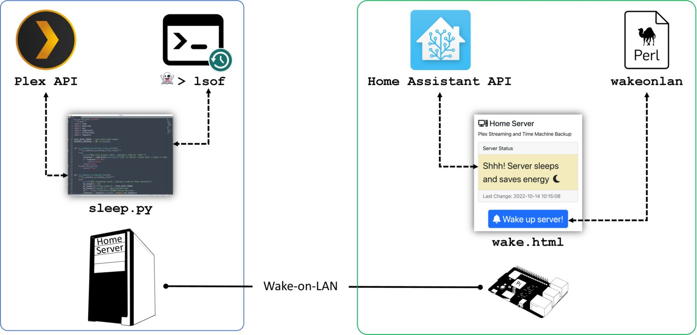

# Home Server that Automatically Suspends to RAM and Wakes up Again
## ... which is used for Plex Media streaming and Time Machine backups.

### Read About It Here:
There is a blog post about it here:
https://maximiliangolla.com/blog/2022-10-wol-plex-server/

## License
The source code in this repository is licensed under the **MIT license**. Refer to [docs/LICENSE](docs/LICENSE) for more information.

## Contact
Visit [my website](https://maximiliangolla.com) or contact me via GitHub.
